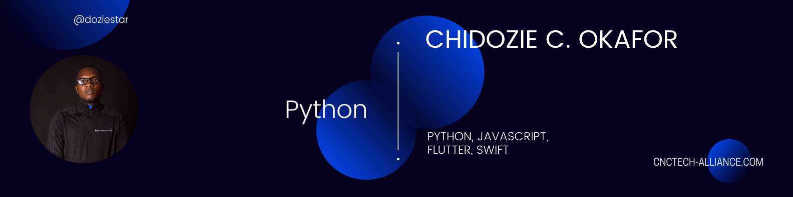

### Hi there. I respect every developer who always strive to be the best. I always learn what is needed and deliver only extra-ordinary result👋

<h1 align="center">Hi 👋, I'm Chidozie C. Okafor</h1>
<h3 align="center">A passionate backend and mobile developer from Nigeria</h3>

  

  

- 🔭 I’m currently working on [Rescue](https://github.com/doziestar/rescue)

- 🌱 I’m currently learning **Swift and C#**

- 👯 I’m looking to collaborate on [Rescue](https://github.com/doziestar/rescue)

- 🤝 I’m looking for help with [Rescue](https://github.com/doziestar/rescue)

- 👨‍💻 All of my projects are available at [dozie.cnctech-alliance.com](dozie.cnctech-alliance.com)

- 💬 Ask me about **Python, Flask, Django, Javascript, React, C#, ASP.Net, Unity**

- 📫 How to reach me **chidosiky2015@gmail.com**

- 📄 Know about my experiences [github.com/doziestar](github.com/doziestar)

- ⚡ Fun fact **I love animals**

### Blogs posts
<!-- BLOG-POST-LIST:START -->
<!-- BLOG-POST-LIST:END -->

<h3 align="left">Connect with me:</h3>

<h3 align="left">Languages and Tools:</h3>

                     </a>            

<h3 align="left">Support:</h3>

   

     

&nbsp;
 

<figure><embed src="https://wakatime.com/share/@doziestar/e9c9eb09-7830-4b0b-bc1c-2305549ed687.svg"></embed></figure>

<!--START_SECTION:waka-->
<!--END_SECTION:waka-->
